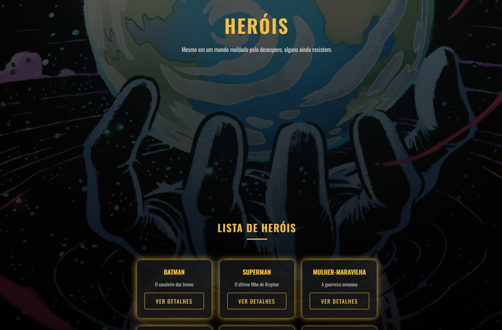
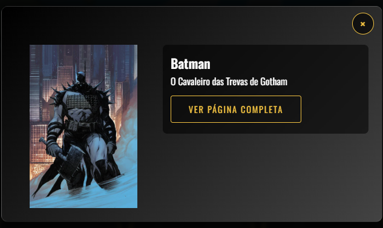
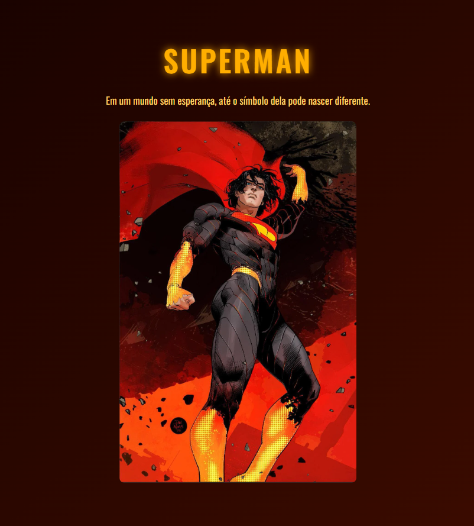
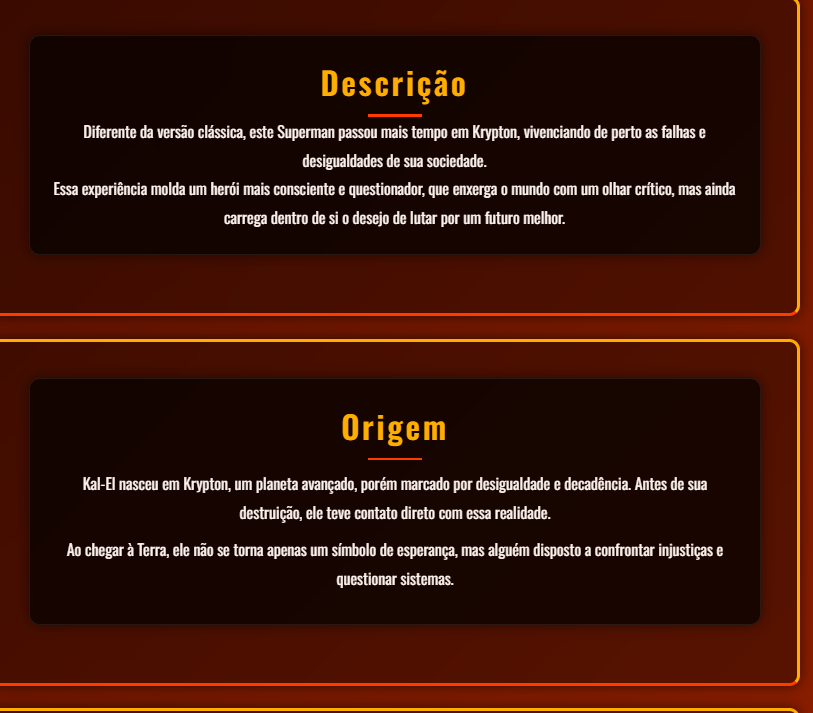

DC Absolute Mini Wiki

Projeto pessoal desenvolvido com HTML, CSS e JavaScript com foco em apresentar personagens do universo DC Absolute em formato de mini wiki interativa.

A proposta do projeto é criar uma experiência visual simples, organizada e intuitiva, permitindo que o usuário visualize personagens, leia descrições rápidas e acesse páginas individuais com mais detalhes sobre cada herói ou vilão.

## Preview do Projeto

### Página principal

### Modal de detalhes

### Página individual do personagem

### Informações detalhadas

Tecnologias utilizadas
HTML5
CSS3
JavaScript
Git
GitHub
Funcionalidades atuais
Página principal com lista de personagens
Cards interativos
Botão "Ver detalhes"
Modal com informações rápidas
Página individual para personagens
Layout responsivo
Melhorias visuais com CSS
Organização da estrutura do projeto
Objetivo do projeto

Este projeto foi criado com o objetivo de praticar desenvolvimento Front-End, organização de código, manipulação com JavaScript e evolução contínua de projeto pessoal.

Além disso, serve como portfólio prático durante minha formação em Ciência da Computação.

Melhorias futuras
Adicionar mais personagens
Melhorar responsividade
Criar sistema de busca
Adicionar filtros por herói/vilão
Melhorar animações
Refinar experiência do usuário (UX)
Melhorar organização visual das páginas
Como executar
1. Clone este repositório
git clone https://github.com/gabrielbastosg/Dc-Absolute-mini-wiki.git
2. Acesse a pasta do projeto
cd Dc-Absolute-mini-wiki
3. Abra o arquivo principal no navegador

Execute o arquivo herois.html localizado na pasta templates.

Autor

Gabriel Bastos

Estudante de Ciência da Computação | Desenvolvedor em evolução

GitHub:
https://github.com/gabrielbastosg